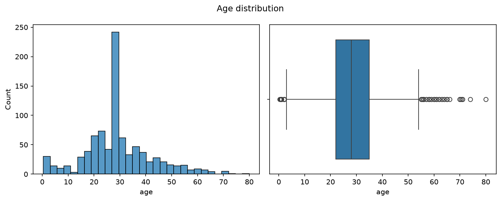
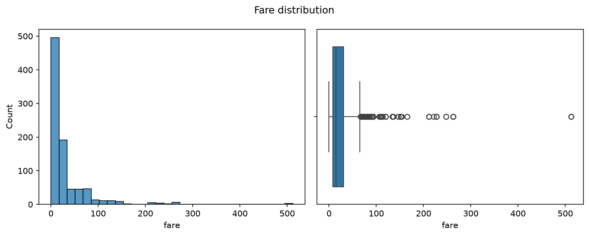
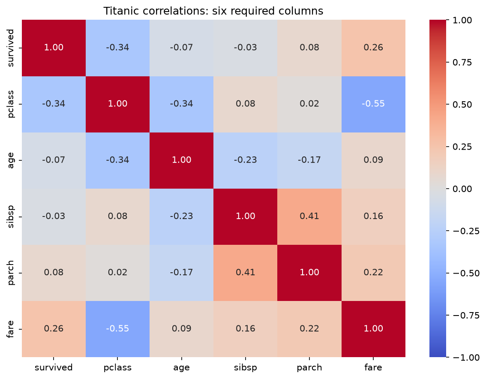
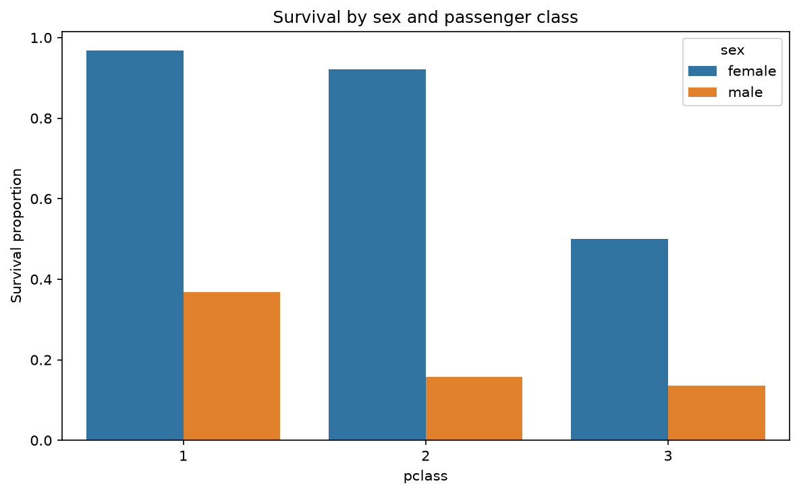
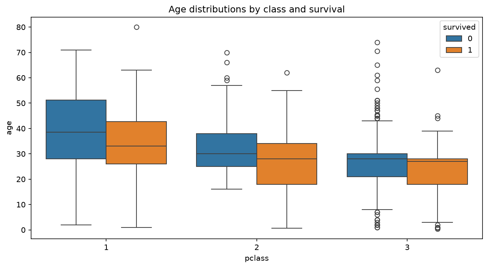
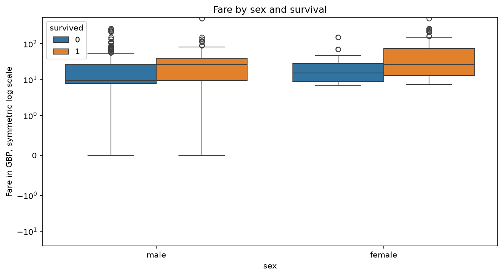
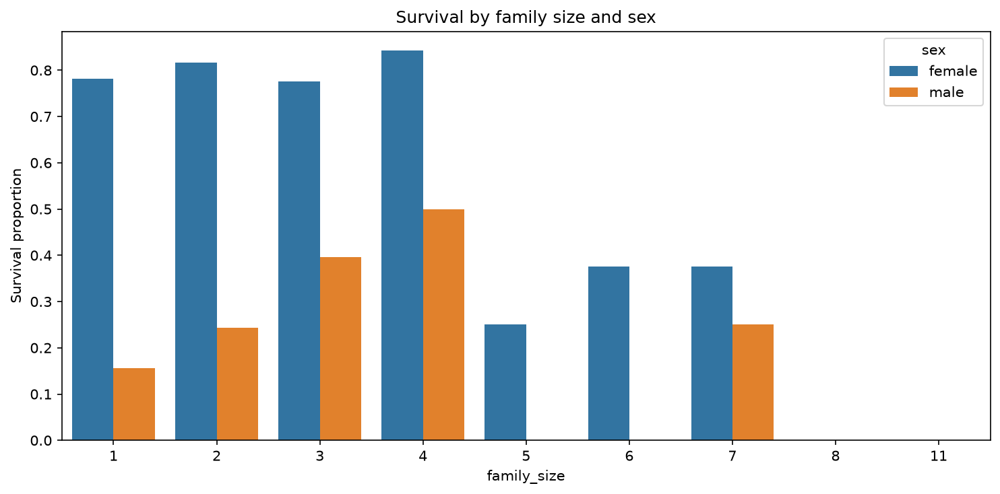

# Titanic Exploratory Analysis

Dataset source: Existing local titanic.csv

Raw shape: (891, 15)

## Dataset profile

```text
<class 'pandas.DataFrame'>
RangeIndex: 891 entries, 0 to 890
Data columns (total 15 columns):
 #   Column       Non-Null Count  Dtype  
---  ------       --------------  -----  
 0   survived     891 non-null    int64  
 1   pclass       891 non-null    int64  
 2   sex          891 non-null    str    
 3   age          714 non-null    float64
 4   sibsp        891 non-null    int64  
 5   parch        891 non-null    int64  
 6   fare         891 non-null    float64
 7   embarked     889 non-null    str    
 8   class        891 non-null    str    
 9   who          891 non-null    str    
 10  adult_male   891 non-null    bool   
 11  deck         203 non-null    str    
 12  embark_town  889 non-null    str    
 13  alive        891 non-null    str    
 14  alone        891 non-null    bool   
dtypes: bool(2), float64(2), int64(4), str(7)
memory usage: 92.4 KB
```

```text
         survived      pclass         age       sibsp       parch        fare
count  891.000000  891.000000  714.000000  891.000000  891.000000  891.000000
mean     0.383838    2.308642   29.699118    0.523008    0.381594   32.204208
std      0.486592    0.836071   14.526497    1.102743    0.806057   49.693429
min      0.000000    1.000000    0.420000    0.000000    0.000000    0.000000
25%      0.000000    2.000000   20.125000    0.000000    0.000000    7.910400
50%      0.000000    3.000000   28.000000    0.000000    0.000000   14.454200
75%      1.000000    3.000000   38.000000    1.000000    0.000000   31.000000
max      1.000000    3.000000   80.000000    8.000000    6.000000  512.329200
```

## Survival class balance

```text
          count  percentage
survived                   
0           549   61.616162
1           342   38.383838
```

A stratified modeling split will preserve approximately the same survived/not-survived proportions in training and test data.

## Missing values and cleaning decisions

```text
             missing_percent
deck               77.216611
age                19.865320
embarked            0.224467
embark_town         0.224467
```

- deck: 77.2166% missing. Drop this column because most values are missing; filling them would introduce substantial assumptions.

- age: 19.8653% missing. Impute with median 28.000 for EDA. The median is less sensitive to extreme values.

- embarked: 0.2245% missing. Drop rows missing this column.

- embark_town: 0.2245% missing. Drop rows missing this column.

Cleaned EDA shape: (889, 14)

titanic.csv remains the unmodified offline fallback. titanic_eda_cleaned.csv is the exploratory view of that same load. Modeling will use the raw fallback and fit its own imputer, encoder, and scaler only within training data.

## Age and fare distributions



Age has 65 observations outside the IQR bounds [2.500, 54.500]. These are flagged for inspection and retained because an extreme value alone does not establish a data error.



Fare has 114 observations outside the IQR bounds [-26.761, 65.656]. These are flagged for inspection and retained because an extreme value alone does not establish a data error.

```text
  column       Q1    Q3  lower_bound  upper_bound  outlier_count
0    age  22.0000  35.0       2.5000      54.5000             65
1   fare   7.8958  31.0     -26.7605      65.6563            114
```

Fare mean = 32.097; median = 14.454; mode(s) = [8.05]; sample skewness = 4.801. Compare these values with the histogram: a mean above the median and a long upper tail support right skew. The mode describes the most frequent fare and need not follow a strict ordering for every skewed distribution.

## Survival rates using boolean masks

```text
                  group  passengers  survival_rate
0            sex=female         312       0.740385
1              sex=male         577       0.188908
2               class=1         214       0.626168
3   sex=female, class=1          92       0.967391
4     sex=male, class=1         122       0.368852
5               class=2         184       0.472826
6   sex=female, class=2          76       0.921053
7     sex=male, class=2         108       0.157407
8               class=3         491       0.242363
9   sex=female, class=3         144       0.500000
10    sex=male, class=3         347       0.135447
```

## Correlations



- pclass and fare: r = -0.5482, a negative association. Higher values of pclass tend to accompany lower values of fare; this does not establish causation.

- sibsp and parch: r = 0.4145, a positive association. Higher values of sibsp tend to accompany higher values of parch; this does not establish causation.

Passenger class uses 1 for first class and 3 for third class, so a higher class number means a lower travel class. adult_male and alone are excluded as required. Each pair is ranked once, excluding the diagonal and mirrored duplicates.

## Four-chart survival story



Overall female survival was 74.0%, compared with 18.9% for males. The grouped bars show whether this difference also appears within passenger classes. These are observational comparisons and do not isolate the effect of sex from all other factors.



Median age was 28.0 for survivors and 28.0 for non-survivors in the exploratory data. Class-specific boxes show variation that an overall median can hide. Age imputation adds observations at the median and must be considered when interpreting these distributions.



Median fare was GBP 26.00 for survivors and GBP 10.50 for non-survivors. The transformed axis keeps zero fares visible while compressing the long upper tail. Fare is associated with travel class, so this does not show that paying more directly caused survival.



```text
                    count      mean
family_size sex                    
1           female    124  0.782258
            male      411  0.155718
2           female     87  0.816092
            male       74  0.243243
3           female     49  0.775510
            male       53  0.396226
4           female     19  0.842105
            male       10  0.500000
5           female     12  0.250000
            male        3  0.000000
6           female      8  0.375000
            male       14  0.000000
7           female      8  0.375000
            male        4  0.250000
8           female      2  0.000000
            male        4  0.000000
11          female      3  0.000000
            male        4  0.000000
```

Family size counts the passenger plus siblings/spouses and parents/children aboard. The chart examines whether the sex-related survival pattern varies across family sizes. Consult the accompanying counts: rates for very small groups are unstable and should not drive strong conclusions.

## Exploratory standardization

```text
  column  before_mean  before_std_population    after_mean  after_std_population
0    age    29.315152              12.977627  2.717486e-16                   1.0
1   fare    32.096681              49.669545  1.398706e-16                   1.0
```

Both transformed columns have approximately mean 0 and population standard deviation 1. This full-data calculation is an EDA check only; these values will not enter modeling.
