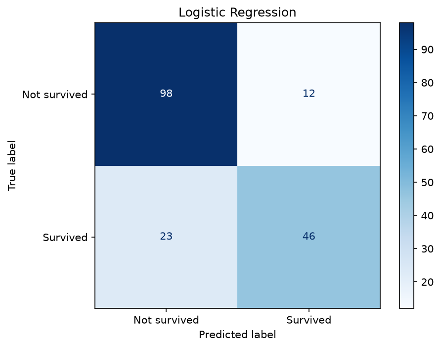
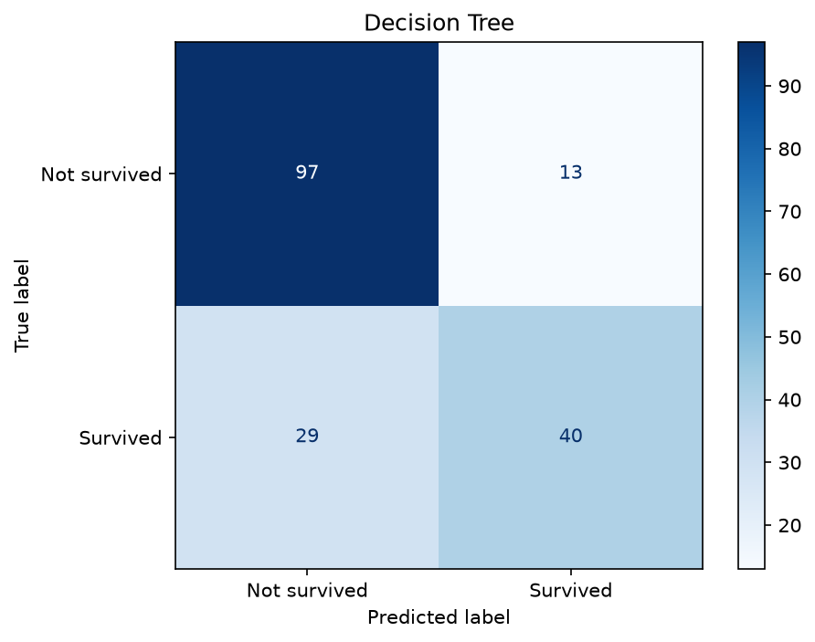
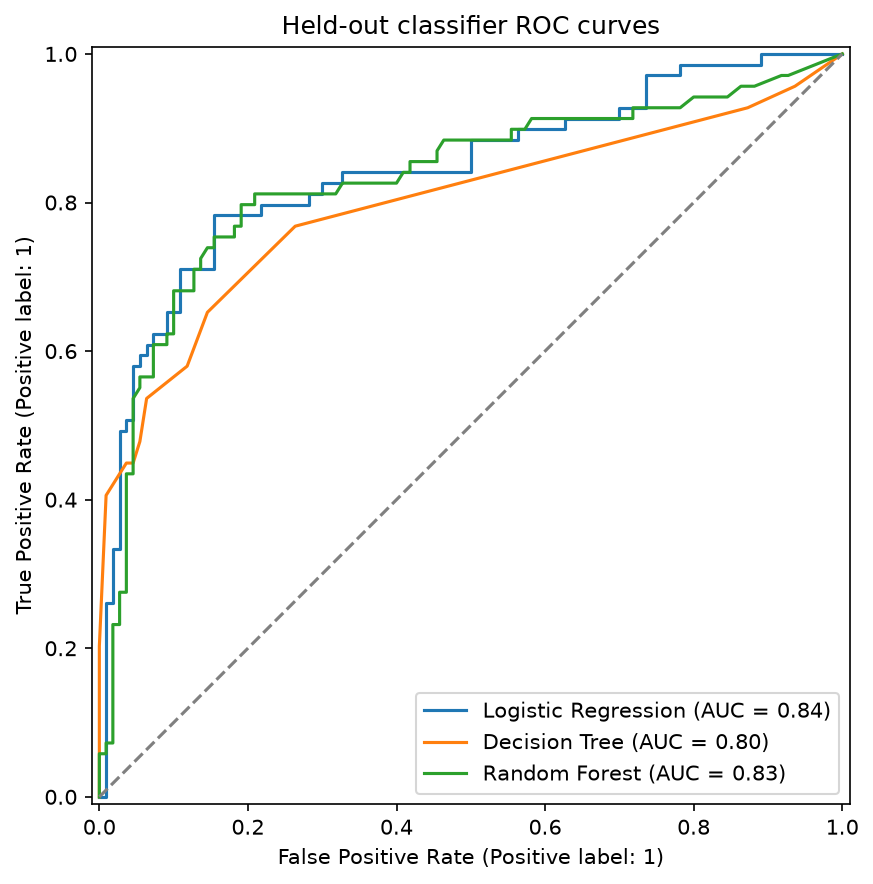
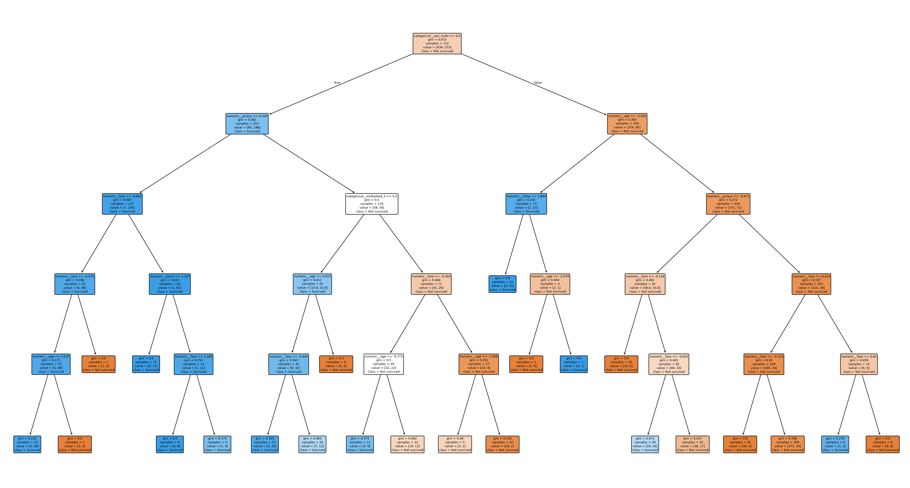
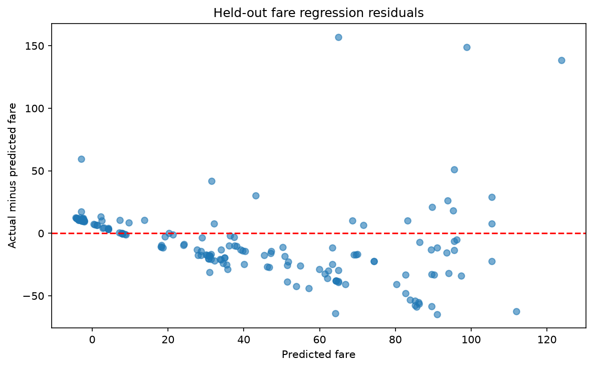

# Titanic Modeling Report

## Data source and preprocessing

This script continues from titanic.csv saved by 01_eda.py. It does not independently reload the dataset from Seaborn. The raw fallback is retained so full-data exploratory imputation and scaling do not enter model evaluation.

Numeric features use training-only median imputation and StandardScaler. Categorical features use training-only mode imputation and one-hot encoding. Each preprocessing operation is fitted inside the training folds during cross-validation.

The target is survived. alive is excluded because it reveals the target directly. Redundant fields such as class, embark_town, who, adult_male, and alone are excluded. deck is omitted because of its high missingness.

## Class balance and stratified split

```text
split  rows  not_survived  survived  survival_rate
 full   891           549       342         0.3838
train   712           439       273         0.3834
 test   179           110        69         0.3855
```

The full survival proportion is 38.38%. Stratification preserves approximately the same class proportions in training and test data, reducing the risk of an unrepresentative test split.

## Three classifier comparison

### Logistic Regression confusion matrix

```text
       actual_class  predicted_not_survived  predicted_survived
actual_not_survived                      98                  12
    actual_survived                      23                  46
```



### Decision Tree confusion matrix

```text
       actual_class  predicted_not_survived  predicted_survived
actual_not_survived                      97                  13
    actual_survived                      29                  40
```



### Random Forest confusion matrix

```text
       actual_class  predicted_not_survived  predicted_survived
actual_not_survived                      96                  14
    actual_survived                      20                  49
```


```text
              model  accuracy  precision  recall     f1    auc
Logistic Regression    0.8045     0.7931  0.6667 0.7244 0.8435
      Decision Tree    0.7654     0.7547  0.5797 0.6557 0.7971
      Random Forest    0.8101     0.7778  0.7101 0.7424 0.8310
```





## Imbalance handling comparison

```text
           model  precision  recall     f1  training_cv_f1
        Baseline     0.7931  0.6667 0.7244          0.7246
Balanced weights     0.7297  0.7826 0.7552          0.7328
           SMOTE     0.7397  0.7826 0.7606          0.7305
```

Balanced weights achieved the highest training CV F1 among the imbalance variants (0.7328). Its test precision was 0.7297, recall 0.7826, and F1 0.7552. F1 is used to balance precision and recall.

SMOTE is inside an imbalanced-learn pipeline, so only training folds are oversampled. Test and validation rows are never resampled. Applying ordinary SMOTE after one-hot encoding can produce fractional indicator values; this is a limitation of this baseline experiment.

## Random Forest tuning

Best parameters: {'model__max_depth': 5, 'model__max_features': 'sqrt', 'model__n_estimators': 200}

Best training CV F1: 0.7575

OOB accuracy: 0.8272

```text
              model  accuracy  precision  recall     f1   auc
Tuned Random Forest    0.7933       0.82  0.5942 0.6891 0.842
```

OOB accuracy is a training diagnostic, not the same metric as CV F1. The final preprocessor is fitted on the training split, so OOB performance does not replace fold-isolated cross-validation or held-out evaluation.

## Classifier recommendation

```text
                                 model  training_cv_f1
                   Logistic Regression          0.7246
                         Decision Tree          0.7213
                         Random Forest          0.7335
                   Tuned Random Forest          0.7575
Logistic Regression (Balanced weights)          0.7328
           Logistic Regression (SMOTE)          0.7305
```

I recommend Tuned Random Forest as the candidate for further validation because it had the highest training CV F1 among the evaluated candidates (0.7575). Its held-out accuracy was 0.7933, precision 0.8200, recall 0.5942, F1 0.6891, and AUC 0.8420. Selection used training CV scores rather than test scores. The tuned forest's best CV score is subject to tuning selection optimism, so independent validation would be needed before deployment. Titanic data supports this educational comparison, not operational deployment claims.

PASS: The complete saved pipeline was reloaded and produced identical predictions on raw, unprocessed passenger records.

## Fare regression

```text
            model     mae    rmse     r2  adjusted_r2
Linear Regression 20.8094 30.4731 0.3999       0.3753
```

Regression predicts fare using class, age, family counts, sex, and embarkation port. Fare and survival-related outcomes are excluded from predictors. Adjusted R-squared applies the requested adjustment using 179 held-out rows and 7 encoded predictors, excluding the intercept; it is a descriptive held-out adjustment.



```text
            prediction_band  count       std
(-4.313000000000001, 2.352]     45  7.489814
            (2.352, 31.379]     45 10.390688
           (31.379, 64.673]     44 17.832770
          (64.673, 123.837]     45 50.962094
```

Residual standard-deviation ratio across prediction bands: 6.804. The residual spread varies substantially across fitted values, suggesting heteroscedasticity. This threshold is a descriptive heuristic, not a formal statistical test; interpret it alongside the residual plot.

## Final model comparison

```text
              model  classification_accuracy  classification_precision  classification_recall  classification_f1  classification_auc  regression_mae  regression_rmse  regression_r2  regression_adjusted_r2
Logistic Regression                   0.8045                    0.7931                 0.6667             0.7244              0.8435             NaN              NaN            NaN                     NaN
      Decision Tree                   0.7654                    0.7547                 0.5797             0.6557              0.7971             NaN              NaN            NaN                     NaN
      Random Forest                   0.8101                    0.7778                 0.7101             0.7424              0.8310             NaN              NaN            NaN                     NaN
Tuned Random Forest                   0.7933                    0.8200                 0.5942             0.6891              0.8420             NaN              NaN            NaN                     NaN
  Linear Regression                      NaN                       NaN                    NaN                NaN                 NaN         20.8094          30.4731         0.3999                  0.3753
```

Classification and regression metrics are separate groups and are not comparable on one shared scale. Missing cells mean that the metric does not apply to that model type.
